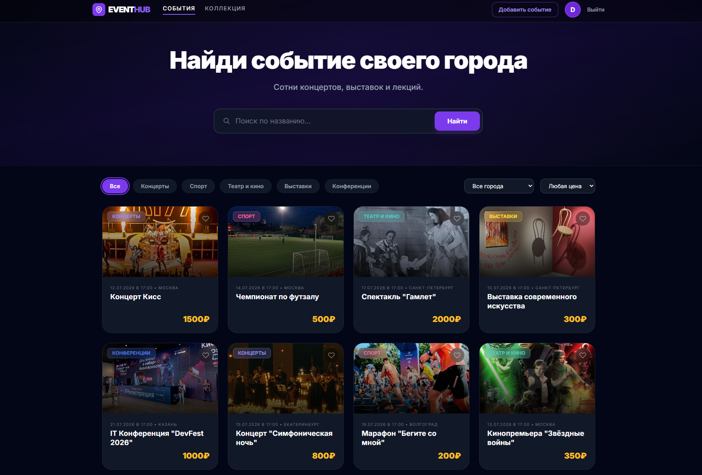
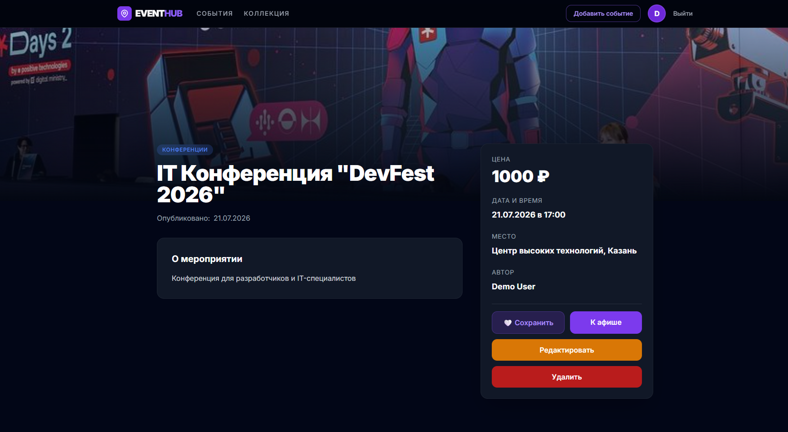
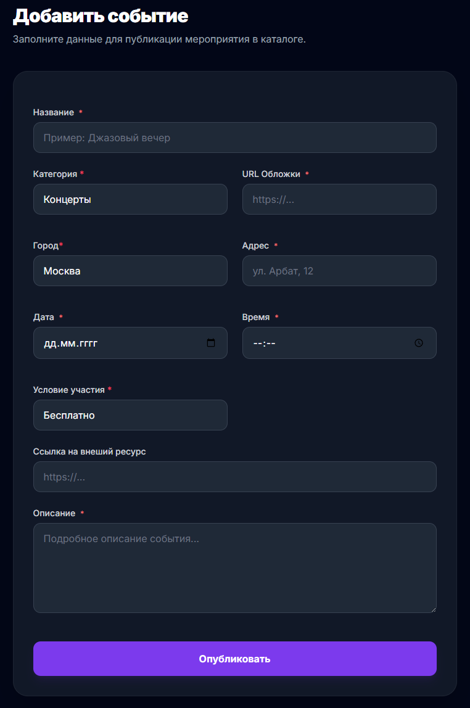
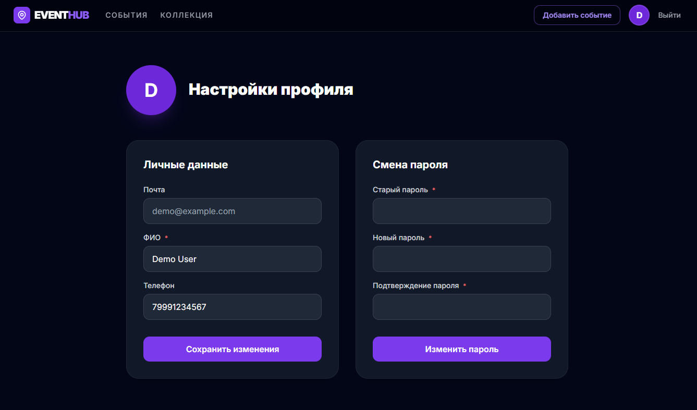

# EventHub 🎉

Веб-сайт-агрегатор мероприятий с сессионной авторизацией, пользовательскими карточками событий и избранным.

> **Назначение:** платформа, где пользователи сами создают, редактируют и находят мероприятия — от концертов и лекций до платных ивентов со ссылкой на оплату.

## 📋 Описание

Изначально проект был выполнен как домашнее задание для университета по заказу приятеля, но впоследствии доработан и переоформлен как самостоятельный pet-проект для портфолио. Сайт на Flask с собственной реализацией авторизации (хеширование пароля, сессии), CRUD-механикой для мероприятий, избранным, фильтрацией и поиском.

## 🛠 Технологический стек

### Backend


- **Flask** — маршрутизация, представления, организация приложения через паттерн **App Factory**
- **Flask-SQLAlchemy / SQLAlchemy** — ORM, модели и связи между сущностями
- **WTForms** — серверная валидация форм (регистрация, создание мероприятия, профиль)
- **Werkzeug** — хеширование паролей
- **Сессии** — собственная реализация авторизации без сторонних библиотек (Flask-Login не используется)
- **Jinja2** — серверный рендеринг шаблонов

### Frontend


- **HTML5 / Tailwind CSS / JavaScript** (Vanilla JS)
- JavaScript используется только как часть UI (поиск, фильтры, лайки, интерактив) — без AJAX/REST-запросов, весь проект построен по принципу **Flask-way**: рендеринг и логика полностью на сервере
- Адаптивная вёрстка под мобильные устройства
- Цветовая индикация категорий — каждая категория имеет свой цвет и визуально выделяется на карточке мероприятия

### Database & Tools


- **SQLite3** — база данных, инициализация и наполнение демоданными через CLI-скрипт
- **Git / GitHub** — контроль версий и хранение исходного кода

## ✨ Функциональность

### Публичная часть / авторизация
- 🔐 **Регистрация, вход и выход** из аккаунта через собственную сессионную авторизацию
- 🔑 Хеширование паролей, защита форм от некорректного ввода через WTForms

### Мероприятия
- 🏠 **Главная страница** со списком всех мероприятий
- ➕ **Создание, редактирование и удаление** мероприятий их авторами
- 🗂️ Карточка мероприятия содержит: название, адрес, дату и время, изображение по ссылке, цену и подробное описание
- 🔗 Возможность указать **внешнюю ссылку** (на сайт с оплатой, чат или мессенджер) — в этом случае на странице мероприятия появляется кнопка **«Подробнее»**, ведущая по этой ссылке
- 🎨 Каждая категория мероприятия имеет свой цвет и выделяется на карточке

### Поиск и фильтрация
- 🔍 **Поиск по названию** мероприятия
- 🏷️ **Фильтр по категории** (с цветовой индикацией)
- 🌆 **Фильтр по городу**
- 💰 **Фильтр по цене** (платные / бесплатные)

### Избранное
- ❤️ **Лайк мероприятия** прямо с карточки
- 📌 Отдельная **страница «Коллекция»** со всеми лайкнутыми мероприятиями
- 🗑️ Удаление мероприятия из избранного прямо со страницы коллекции

### Профиль
- 👤 Страница **профиля пользователя**
- ✏️ Изменение имени и номера телефона
- 🔒 Смена пароля

## 🗂 Структура проекта
```
event-hub/
├── app/
│   ├── __pycache__/
│   ├── static/
│   │   ├── css/
│   │   │   └── style.css          # Стили
│   │   ├── images/                # Ассеты, иконки
│   │   └── js/
│   │       ├── add_event.js       # Логика формы создания мероприятия
│   │       ├── app.js             # Общие скрипты
│   │       ├── collection.js      # Логика страницы «Коллекция»
│   │       ├── event.js           # Логика страницы мероприятия
│   │       └── index.js           # Поиск и фильтрация на главной
│   ├── templates/
│   │   ├── auth/
│   │   │   ├── login.html
│   │   │   └── register.html
│   │   ├── event/
│   │   │   ├── add-event.html     # Создание мероприятия
│   │   │   ├── collection.html    # Избранные мероприятия
│   │   │   ├── edit-event.html    # Редактирование мероприятия
│   │   │   ├── event.html         # Детальная страница мероприятия
│   │   │   ├── index.html         # Главная страница со списком
│   │   │   └── profile.html       # Профиль пользователя
│   │   ├── macros/
│   │   │   └── _formhelpers.html  # Макросы для форм
│   │   ├── base.html              # Базовый layout
│   │   └── navbar.html            # Переиспользуемая навигация
│   ├── __init__.py                # App Factory, инициализация расширений
│   ├── auth.py                    # Blueprint: регистрация, вход, выход
│   ├── config.py                  # Конфигурация приложения
│   ├── db.py                      # Инициализация SQLAlchemy
│   ├── event.py                   # Blueprint: CRUD мероприятий, фильтры, поиск, избранное
│   ├── forms.py                   # WTForms-формы
│   ├── main.py                    # Общие маршруты
│   ├── models.py                  # Модели БД (User, Event, Category, City, Favorite)
│   └── seed.py                    # CLI-скрипт наполнения БД демоданными
├── instance/
│   └── app.sqlite                 # База данных SQLite
├── tests/                         # Тесты
├── README.md
└── requirements.txt
```

## 🗄 Модели данных

### User (Пользователь)
```python
- id: int
- fullname: str
- email: str (unique)
- phone: str (unique)
- password_hash: str
```

### Category (Категория)
```python
- id: int
- name: str (unique)
- color: str
```

### City (Город)
```python
- id: int
- name: str (unique)
```

### Event (Мероприятие)
```python
- id: int
- name: str
- slug: str (unique)
- category_id: int (FK)
- image_url: str
- city_id: int (FK)
- address: str
- date: datetime
- price: str (nullable — «Бесплатно», если не указана)
- description: str
- user_id: int (FK)
- external_url: str (nullable)
```

### Favorite (Избранное)
```python
- id: int
- user_id: int (FK)
- event_id: int (FK)
```

## 🔐 Безопасность

- **Собственная сессионная авторизация** без сторонних библиотек, хеширование паролей через Werkzeug
- **Серверная валидация** всех форм через WTForms (регистрация, создание/редактирование мероприятия, профиль)
- Проверка прав доступа: редактировать и удалять мероприятие может только его автор

## 📦 Установка и запуск

1. **Клонировать репозиторий**
```bash
   git clone https://github.com/kuramagod/event-hub.git
   cd event-hub
```

2. **Создать виртуальное окружение**
```bash
   python -m venv venv
   source venv/bin/activate  # Linux/Mac
   venv\Scripts\activate     # Windows
```

3. **Установить зависимости**
```bash
   pip install -r requirements.txt
```

4. **Инициализировать базу данных и заполнить демоданными**
```bash
   flask --app app init-db
   flask --app app seed-db
```

5. **Запустить сервер**
```bash
   flask --app app run
```

Приложение будет доступно по адресу: `http://localhost:5000`

## 🎨 Дизайн
 
### Главная страница
 

 
### Страница мероприятия
 


### Профиль пользователя


 
### Профиль пользователя
 


## 🏗 Архитектурные решения

- **App Factory** — приложение собирается через фабричную функцию, что упрощает конфигурацию и тестирование
- **Blueprint-структура** — логика разделена по модулям (авторизация, мероприятия, избранное, профиль) для читаемости и удобства расширения
- **Flask-way подход** — вся логика и рендеринг на стороне сервера, JavaScript используется исключительно для интерактива в UI (поиск, фильтры, лайки), без REST/AJAX-запросов
- **Slug для мероприятий** — человекочитаемые и уникальные URL-адреса вместо числовых id
- **Демоданные через CLI** — быстрое наполнение базы для демонстрации функционала

## 📝 Возможности для расширения

- [ ] Пагинация списка мероприятий
- [ ] Загрузка изображений файлом вместо ссылки
- [ ] Админка
- [ ] Комментарии и отзывы к мероприятиям

## 📄 Лицензия

Учебный / pet-проект
